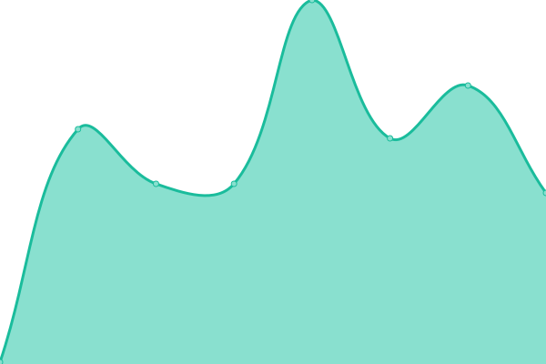
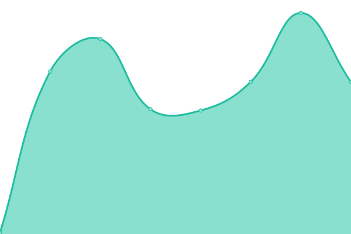

This repository contains the open-source uptime monitor and status page for [Cardano Foundation](https://cardanofoundation.org), powered by [Upptime](https://github.com/upptime/upptime).

With [Upptime](https://upptime.js.org), you can get your own unlimited and free uptime monitor and status page, powered entirely by a GitHub repository. We use [Issues](https://github.com/cardano-foundation/cf-token-metadata-registry-status/issues) as incident reports, [Actions](https://github.com/cardano-foundation/cf-token-metadata-registry-status/actions) as uptime monitors, and [Pages]() for the status page.

<!--start: status pages-->
<!-- This summary is generated by Upptime (https://github.com/upptime/upptime) -->
<!-- Do not edit this manually, your changes will be overwritten -->
<!-- prettier-ignore -->
| URL | Status | History | Response Time | Uptime |
| --- | ------ | ------- | ------------- | ------ |
|  [API (All properties)](https://tokens.cardano.org/metadata/4ffaa4ef3217df37c4995bb96066af4cb68dfcc66b9f2a10e0c333b95779726d73746f6e65) | 🟩 Up | [api-all-properties.yml](https://github.com/cardano-foundation/cf-token-metadata-registry-status/commits/HEAD/history/api-all-properties.yml) | 

 781ms
     
 | 

<a href="https://https://tokens.cardano.org/metadata/query/history/api-all-properties">100.00%</a>
    

|  [API (Specific property)](https://tokens.cardano.org/metadata/4ffaa4ef3217df37c4995bb96066af4cb68dfcc66b9f2a10e0c333b95779726d73746f6e65/properties/decimals) | 🟩 Up | [api-specific-property.yml](https://github.com/cardano-foundation/cf-token-metadata-registry-status/commits/HEAD/history/api-specific-property.yml) | 

 108ms
     
 | 

<a href="https://https://tokens.cardano.org/metadata/query/history/api-specific-property">100.00%</a>
    

|  [API (Batch)](https://tokens.cardano.org/metadata/query) | 🟩 Up | [api-batch.yml](https://github.com/cardano-foundation/cf-token-metadata-registry-status/commits/HEAD/history/api-batch.yml) | 

 94ms
     
 | 

<a href="https://https://tokens.cardano.org/metadata/query/history/api-batch">100.00%</a>
    

<!--end: status pages-->

## 📄 License

- Code: [MIT](./LICENSE) © [Anand Chowdhary](https://anandchowdhary.com), supported by [Pabio](https://pabio.com)
- Data in the `./history` directory: [Open Database License](https://opendatacommons.org/licenses/odbl/1-0/)
